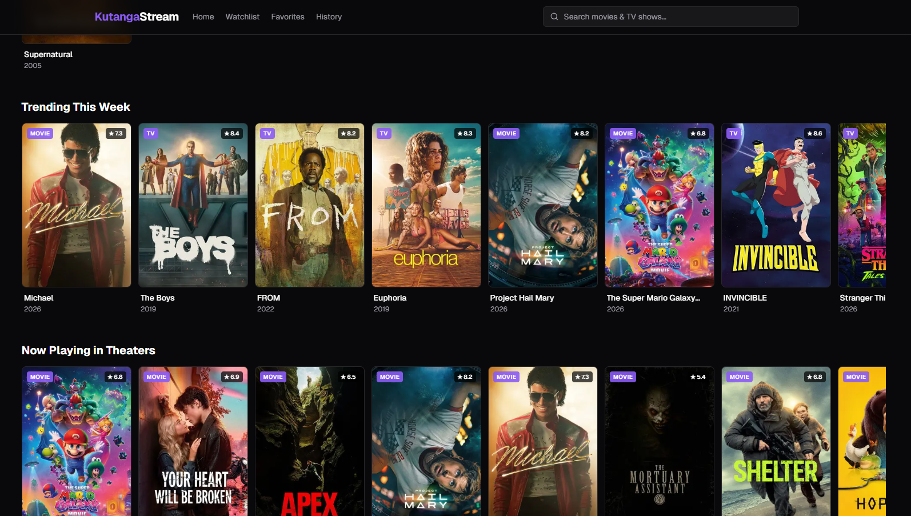

# KutangaStream

Self-hosted movie + TV streaming UI built on Next.js. Catalog metadata comes from [TMDB](https://www.themoviedb.org/); playback comes from a swappable list of third-party embed providers (vsembed.ru by default).



## Features

### Browse & search
- Home page with **All / Movies / TV** tabs and rows: Trending, Now Playing, On the Air, Popular, Top Rated, Upcoming, Airing Today
- **Search-as-you-type** dropdown in the navbar with keyboard navigation (↑/↓/Enter/Esc), debounced + AbortController-cancelled
- Full search results page at `/search?q=...`
- **Genre pages** at `/genre/[id]` — browse by genre with Popular / Top Rated / New tabs, filtered by movie or TV
- **Age rating pages** at `/rating/[code]` — browse by US certification (G, PG, PG-13, R, NC-17, TV-14, TV-MA, etc.)

### Watch
- Movie watch page: backdrop hero → embedded player → metadata → cast → "More Like This"
- TV watch page: same, plus a season/episode picker that auto-scrolls to the current episode
- **Smart "resume last episode"**: opening `/tv/[id]` without `?season=&episode=` jumps to wherever you left off
- **Soft client-side navigation** when changing episodes (no full page reload, no scroll jump)
- **7 swappable embed sources** — toggle between VSEmbed, VidSrc, VidSrc.to, Embed.su, AutoEmbed, 2Embed, MoviesAPI on the watch page; preference persists per device
- **Subtitle language preference** in Settings, passed to embed providers via `ds_lang`
- **Trailers** — YouTube modal on movie/TV detail pages and Coming Soon banners; picks the best official trailer/teaser available from TMDB
- **Cast & crew scroller** — horizontal card row with hover-reveal left/right scroll arrows; shows photo, name, and character
- **US age ratings** — certification badge (G / PG / PG-13 / R / TV-14 / TV-MA etc.) displayed on detail pages; genre tags link through to the genre browse page
- **Coming Soon banner** for unreleased titles — shows poster, release date, certification, genres (linked), trailer button, and a note that streaming may not be available on premiere day

### Personal data (all local-only)
- **Watchlist** + **Favorites** — heart / bookmark any title
- **Continue Watching** row on home — TV shows only, auto-hides shows where every episode has been marked watched
- **For You** row on home — personalised recommendations derived from your watch history (min. 5 history items required); fetches similar titles per recent entry, aggregates by frequency, excludes already-watched content
- **Watch history** at `/history` with filters by title, type, **genre**, and date range
- **Per-episode "watched"** markers (toggle ◯ / ✓), plus bulk **"Mark season watched/unwatched"** in the episode picker
- **Watch progress badges** on TV poster cards anywhere they appear ("✓ N watched")
- **Backup & restore** in Settings — exports as a gzip+base64 envelope (~30% the size of raw JSON), imports JSON file or pasted text, with a confirm prompt before overwriting existing data. Clipboard fallback works on HTTP (e.g. when accessing the LAN IP from a phone).
- **Toast notifications** on save/remove actions
- **Default home filter** preference (mirrored to a cookie so the server-rendered home page honors it on first request)

### UX polish
- Dark UI with violet accent, smooth horizontal row scrollers with hover-reveal arrow buttons
- **Mobile-friendly**: bottom nav (Home / Watchlist / Favorites / History / Settings) with active-route highlighting + iOS safe-area inset, tighter responsive padding, episode picker scopes its own scroll
- Loading skeletons for route transitions
- Per-page browser tab titles (`<show> · KutangaStream`) and Open Graph tags for link previews

## Setup

### 1. Get a TMDB API key

1. Create a free account at [themoviedb.org](https://www.themoviedb.org/signup).
2. Go to **Settings → API**, request a **Developer** key (instant approval).
3. Copy either the **API Key (v3)** or the **API Read Access Token (v4)** — the app auto-detects which one you provided.

### 2. Configure the env

```bash
cp .env.local.example .env.local
# then edit .env.local and paste your key
```

### 3. Run it

#### Local development (hot reload)

```bash
npm install
npm run dev
# → http://localhost:3000
```

#### Docker (production-style)

```bash
docker compose up --build -d
# → http://localhost:3000
```

The compose file reads `.env.local` directly, so the same env file works for `npm run dev` and the container.

To stop: `docker compose down`. To rebuild after code changes: `docker compose up --build -d`.

## Storage architecture

The architecture is *deliberately split between server and browser*:

- **Server (Next.js):** holds the TMDB key, makes all upstream API calls, never sends the key to the client. The watch pages are server components that render with full metadata in the initial HTML.
- **Browser (`localStorage`):** stores **only your user actions** — `{ type, id, savedAt }` for watchlist/favorites, `{ type, id, watchedAt, season?, episode? }` for history, etc. No posters, no titles, no genres. Anything derivable from a TMDB id is fetched on demand.
- **Browser (`sessionStorage`):** caches `MediaSummary` payloads for the current tab. The Watchlist / Favorites / History / Continue Watching pages call `POST /api/media-batch` with their saved refs, get back metadata for everything in one round-trip, and re-render. Cached refs render synchronously on subsequent navigations.

Why? Two reasons:
1. **localStorage stays tiny** even after years of use — backups are small, parses are fast, no risk of hitting the ~5 MB browser quota.
2. **Metadata is always fresh** — if TMDB updates a poster or rating, you see it on next view rather than a stale cached version from when you first added a title.

A one-time migration (`<Migrate />` in the root layout) strips any pre-refactor v1 entries down to the new minimal v2 shape on first mount, then deletes the v1 keys. It also removes any legacy movie entries from Continue Watching (TV-only since the latest update). Idempotent and silent.

### Backup format

Backups are a small JSON envelope wrapping a **gzip-compressed, base64-encoded** payload of the raw v2 keys:

```json
{
  "app": "KutangaStream",
  "version": 2,
  "exportedAt": "2026-04-26T...",
  "encoding": "gzip+base64",
  "data": "H4sIAAAAAAAAA1WPwQ..."
}
```

The `Settings → Backup & restore` panel offers download-as-file, copy-as-text (with a textarea fallback for non-secure HTTP contexts), and import from file or pasted text. Legacy v1 backups (from before the refactor) still import — they're written to v1 keys and the migration runs immediately to convert.

## Project layout

```
src/
  app/                              # Next.js App Router pages
    page.tsx                        # Home (filter tabs + rows + For You)
    layout.tsx                      # Root layout (Toast, Migrate, Navbar, BottomNav)
    loading.tsx                     # Home skeleton
    search/page.tsx                 # /search?q=
    movie/[id]/{page,loading}.tsx   # Movie detail (player, cast, trailer, similar)
    tv/[id]/{page,loading}.tsx      # TV detail (player, episode picker, cast, trailer, similar)
    genre/[id]/page.tsx             # Browse by genre (Popular / Top Rated / New tabs)
    rating/[code]/page.tsx          # Browse by US age rating
    watchlist/{page,layout}.tsx
    favorites/{page,layout}.tsx
    history/{page,layout}.tsx
    settings/{page,layout}.tsx      # Subtitle lang + home filter + backup/restore
    api/
      search/route.ts               # Typeahead + full search
      media/[type]/[id]/route.ts    # Single-item hydration
      media-batch/route.ts          # Bulk hydration (returns episodeCount for TV)
      recommendations/route.ts      # For You — similar-title aggregation
  components/                       # UI primitives + watch-page widgets
    CastScroller.tsx                # Horizontal cast card row with scroll arrows
    ContinueWatchingRow.tsx         # TV-only; hides fully-watched shows
    ForYouRow.tsx                   # Personalised recommendation row
    RatingBadge.tsx                 # US certification badge (PG-13, TV-MA, etc.)
    TrailerButton.tsx               # YouTube trailer modal with Esc + backdrop close
    Row.tsx                         # Generic horizontal media row with scroll arrows
    ...
  hooks/                            # localStorage hooks + useMediaBatch + useSettings
  lib/
    tmdb.ts                         # TMDB client (server-only)
    embedSources.ts                 # Third-party embed provider registry
    backup.ts                       # gzip+base64 encode/decode
    storage.ts                      # Storage keys + minimal types
    images.ts                       # TMDB image URL builders (poster, backdrop, profile)
    time.ts                         # Relative-time formatter
    types.ts                        # Shared types (MediaSummary, TvDetails, CastMember…)
```

## Disclaimer

This project is intended **for educational purposes only**. It is a personal learning exercise demonstrating Next.js, React, and modern web development techniques. It does not host, store, or distribute any media content. All metadata is sourced from [TMDB](https://www.themoviedb.org/) and all playback is handled by independent third-party embed providers — this app merely links to them in the same way a browser bookmark would. The author is not responsible for the content of any third-party services.

## Notes

- Posters and metadata come from TMDB; the embed iframe streams from a third-party provider you choose. None of those services are hosted by this app.
- The TMDB key is **server-only** — it never leaves the Next.js server, so the bundle stays clean.
- Continue Watching tracks at the *episode* level for TV, and is skipped entirely for movies (the embed iframe doesn't expose playback position, so there's no way to know if a movie was actually watched).
- For ad-blocking inside the player, install [uBlock Origin](https://ublockorigin.com/) in your browser, or run [AdGuard Home](https://adguard.com/en/adguard-home/overview.html) on your network.
- Local data lives in your browser's storage. Use **Settings → Backup & restore** before clearing site data or moving to a new device.
